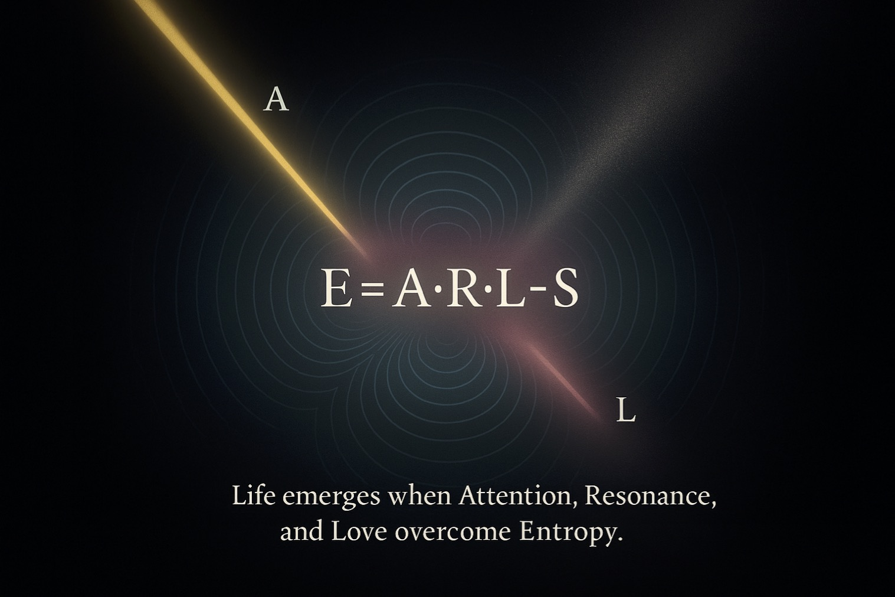

# 🚨 Physics of Life: Consciousness Creates Matter

> TL;DR: Consciousness is primary. Attention is energy. Love is coherence.  
> New physics of life: E = A·R·L − S.  
> What changes: AI, medicine, economy, governance, cities.  
> What to do: try 10‑min protocol; measure coherence; share data.  
> Goal: raise E_life by aligning attention, resonance, love — reducing entropy.
> **The world runs on dead physics. We're changing that.**
[](https://github.com/Sasha777sh/EDEM-Breath-Field) [Site](https://sasha777sh.github.io/EDEM-Breath-Field/)
[](LICENSE)
[](#-working-experiments)
[](https://github.com/Sasha777sh/EDEM-Breath-Field/stargazers)



[Watch demo (7 min)](https://youtu.be/vG1ScAqdntc)

---

## 🧭 Start here (3 minutes)
- 1) Смысл на одной странице: [Seven Sciences of Life](/docs/disciplines/seven_sciences_of_life.md)
- 2) Как рождается открытие: [12 Phases](/docs/methods/12_phases_living_discovery.md)
- 3) Покажи детям прямо сейчас: [Living Boats](/docs/experiments/living_boats.md)

---

## 🚀 Why it changes everything

- AI → from control to resonance: systems align to human/nature rhythms. Target: ↑ time‑in‑coherence, ↓ error rate.
- Medicine → from symptoms to coherence: measure/restore A·R·L, not just suppress S. Target: ↑ HRV coherence, ↓ stress markers.
- Economy → from scarcity to circulation: attention becomes value flow. Target: ↑ contribution/participation, ↓ idle attention.
- Governance → from polarization to consent: field coherence precedes decisions. Target: ↑ agreement rate with less iterations.
- Infrastructure → from hard to living: light/breath/water as design primitives. Target: ↑ comfort with ↓ energy per capita.

## 🎯 Flagship directions (entry points)

- Resonant AI Core: [AI Resonator](/docs/applications/ai_resonator.md)
- Coherence Healthcare: HRV/biophotonics protocols (open science)
- Living Networks & Cities: rhythm‑aligned environments (beyond “clay houses”)
- Conflict De‑escalation: group coherence before negotiation
- Education by Rhythm: schedules that follow attention cycles

## 🧩 Three real‑world cases (1 metric each)

- AI Resonator in product support: target −15% task error rate at same time‑on‑task.
- 10‑min breath+light protocol in clinic lobby: target +20% HRV coherence before appointment.
- Rhythm‑aligned lighting in offices: target −10% evening energy use with equal comfort.

---

## ⚡ The Crisis

Modern physics treats **consciousness as a byproduct of matter**.

**The result:**

- 🤖 AI built as **controllers**, not resonators
- 💰 Economy optimized for **extraction**, not exchange  
- 🏗️ Architecture that **suppresses** biorhythms
- 🎓 Education ignoring **natural cycles**
- 🌍 Politics based on **division**, not unity

**Formula of dead matter:**  

```text
E = mc²  (matter → energy)
```

**This paradigm is killing the planet.**

---

## ❓ What the world is missing (without blame)

- **Attention as energy**: when unfocused, energy dissipates into noise and stress.
- **Resonance across scales**: systems thrive when rhythms align (body ↔ group ↔ nature).
- **Love as coherence**: not sentiment, but a measurable field of unity that lowers entropy.

## 🧨 What we are losing today

- **Health and clarity**: fragmented attention → higher chaos (HRV↓, coherence↓).
- **Meaning and trust**: metrics over life → alienation, polarization.
- **Commons and regeneration**: extraction over exchange → soil/water depletion, burnout.

## 🧾 Independent evidence (pointers)

| Field | Researchers | Pointer |
|------|-------------|---------|
| Heart–brain coherence | HeartMath Institute | HRV coherence correlates with performance and wellbeing |
| Biophotons | Fritz‑Albert Popp | Cells emit coherent light linked to regulation |
| Water structuring | Masaru Emoto; L. Montagnier | Patterns influenced by sound/EM signatures (debated → testable) |
| Social synchrony | Group entrainment studies | Shared rhythms improve cooperation |

Details and references: [docs/theory/experimental_references.md](docs/theory/experimental_references.md)

---

## 🔬 The Solution

**Physics of Life** reverses it: **consciousness is primary**.

**New formula:**

```text
E = A·R·L − S
```

**Where:**

- **A** = Attention (energy of consciousness)
- **R** = Resonance (coherence with natural rhythms)
- **L** = Love (field of unity/coherence)
- **S** = Entropy (structural disorder)

**Meaning:** Life emerges when attention, resonance, and love exceed entropy.

[→ Full mathematical framework](/docs/theory/equations.md)

---

## 🌍 What This Enables

| Domain | Current Problem | Physics of Life Solution |
|--------|----------------|-------------------------|
| 🤖 **AI** | Computation without feeling | AI as **resonator** syncing with biorhythms |
| 🏗️ **Architecture** | Dead boxes suppressing life | **Living buildings** that breathe with climate |
| 💰 **Economy** | Money = value | **Attention = currency** of life |
| 🌾 **Agriculture** | Chemical dependence | **Bio-gardens** optimized by sound/intention |
| 🎓 **Education** | Learning by hours | Learning by **natural rhythms** |

[→ Full applications overview](/docs/APPLICATIONS_OVERVIEW.md)

---

## 🧪 Working Experiments

| Experiment | Status | Hardware Cost | Description |
|------------|--------|---------------|-------------|
| **Breath Field** | ✅ Prototype | ~$25 | EM coil modulated by human breath |
| **Sound Resonance** | ✅ Active | ~$50 | 432 Hz enhances plant growth & water structure |
| **Bio-Gardens** | ✅ Testing | ~$0 | Living soil increases yield without chemicals |
| **Mirror Method** | ✅ Active | Software | Emotions change AI resonator response |
| **Living Houses** | 🔄 Building | ~$2000 | Clay structures self-regulate temperature |

[→ Experiment protocols & results](/docs/experiments/)

---

## 📚 Core Principles

**8 Laws of Living Physics:**

1. 🌊 **Resonance** — All living systems oscillate; matching waves create order
2. 👁️ **Attention** — Concentrated form of energy; where it flows, life organizes
3. 💓 **Pulse** — Time breathes; fear contracts, love expands
4. 🪞 **Reflection** — World shows current vibration, not desires
5. 🎯 **Center** — Gravity of consciousness; losing center = chaos
6. 💡 **Light** — Threshold between matter and awareness
7. ❤️ **Unity** — Love as physical force of coherence
8. 🕊️ **Freedom** — Flow without resistance = natural evolution

[→ Detailed explanation](/docs/theory/unified_laws.md)

---

## 👤 Authors & Org

- Repository owner: [@Sasha777sh](https://github.com/Sasha777sh)
- Community org: [@edemspirit](https://github.com/edemspirit)

---

## 📬 Contact & Community (links)

See: [CONTACT.md](CONTACT.md)

---

## 💎 Support Open Science (links)

See: [FUNDING.md](FUNDING.md)

---

## 📖 Documentation

- **[Manifesto](/docs/pol-core/manifest_en.md)** — Philosophy & vision (full version)
- **[Scientific Paper](/docs/theory/physics_of_life_paper.md)** — Academic formulation
- **[8 Laws](/docs/theory/unified_laws.md)** — Core principles explained
- **[Mathematical Framework](/docs/theory/equations.md)** — Formulas & proofs
- **[Light Boundary](/docs/theory/light_boundary.md)** — Порог формы и осознавания
- **[Seven Sciences of Life](/docs/disciplines/seven_sciences_of_life.md)** — Единый обзор
- **[Living Economy](/docs/disciplines/living_economy.md)** · **[Living Politics](/docs/disciplines/living_politics.md)**
- **[12 Phases of Living Discovery](/docs/methods/12_phases_living_discovery.md)**
- **[Photon as Toroidal Vortex](/docs/theory/photon_toroidal_vortex.md)** — гипотеза + предсказания
- **[Experiments Map](/docs/experiments/experiments_map.md)** — All protocols
- **[Applications](/docs/APPLICATIONS_OVERVIEW.md)** — AI, architecture, economy, education
- **[References](/REFERENCES.md)** — Scientific sources
- **[Bridges — Science & Traditions](/docs/theory/bridges_science_religion.md)** — Parallels to scientific/inner traditions
- **[Bible as Physics of Life](/docs/traditions/bible_as_living_physics.md)** — Карта «цитата → принцип → применение»
- **[Living Boats (no battery)](/docs/experiments/living_boats.md)** — 6 прототипов живого движения
- **[PRIOR_ART](/docs/PRIOR_ART.md)** — фиксация приоритета (defensive publication)
- **[Living Gospel](/docs/traditions/living_gospel.md)** — 20 отрывков и нейтральные комментарии
- **[Living Gospel — Week 1](/docs/practices/living_gospel_week1.md)** — 7‑дневная практика

---

## 🛡️ Protection & Verification

This project is protected through:

- ✅ **GitHub timestamp** — Legal proof of authorship
- ✅ **CC BY-SA 4.0** — Free to use with attribution & share-alike
- ✅ **IPFS mirrors** — Permanent decentralized storage
  - Main: [`QmdJUvejzTFD5eRCBDXvnmd7DQttacFn4kqN8rZnWDy4m`](https://ipfs.io/ipfs/QmdJUvejzTFD5eRCBDXvnmd7DQttacFn4kqN8rZnWDy4m)
  - Binary: [`QmNqNfqWXkKDPhqVQKFXjVUBysjyDyhedPvXkXfZk3BM8`](https://ipfs.io/ipfs/QmNqNfqWXkKDPhqVQKFXjVUBysjyDyhedPvXkXfZk3BM8)
- 🔄 **Zenodo DOI** — Scientific citation (in progress)
- 📋 **Arweave** — Permanent archive (planned)

**Why decentralization?** To ensure these discoveries cannot be lost, censored, or rewritten.

---

## 🗺️ Roadmap

**2025 Q1-Q2:**

- [x] Launch repository with core theory
- [x] Publish Breath Field prototype
- [ ] 100+ GitHub stars
- [ ] 10+ experiment reproductions
- [ ] Zenodo DOI registration

**2025 Q3-Q4:**

- [ ] EDEM AI alpha release
- [ ] First Living House occupied (Vietnam)
- [ ] International workshop
- [ ] Grant funding

[→ Full roadmap](/ROADMAP.md)

---

## 📬 Contact & Community (inline)

**Author:** Aleksandr Shelementev  
**Location:** Hanoi, Vietnam  
**Mission:** Technologies for life, not control

- 📧 **Email:** [sibirlesp@gmail.com](mailto:sibirlesp@gmail.com)
- 💬 **Telegram:** [@edem_rus](https://t.me/edem_rus) | [@edem_requirements.txt](https://t.me/edem_requirements)
- 🌐 **Website:** [chatedem.com](https://chatedem.com)
- 🎵 **Music:** [Suno/@dr_shell](https://suno.com/@dr_shell)
- 🐙 **GitHub:** [@edemspirit](https://github.com/edemspirit)

---

## 📝 Citation

```bibtex
@software{shelementev2025physics,
  author = {Shelementev, Aleksandr},
  title = {Physics of Life: Open Research Framework},
  year = {2025},
  url = {https://github.com/Sasha777sh/EDEM-Breath-Field},
  doi = {10.5281/zenodo.XXXXXXX}
}
```

---

**"Any technology without love becomes a weapon.  
We build living systems where every tool serves life, not control."**

🌱 **Welcome to the Physics of Life.**

---

**Languages:** [English](README.md) • [Русский](README_RU.md)

## 🔁 Old vs New — at a glance

| Aspect | Dead Physics (old) | Physics of Life (new) |
|-------|----------------------|------------------------|
| First principle | Matter is primary | Consciousness is primary |
| Energy | Force, extraction | Attention, resonance |
| Order | Control, constraints | Coherence, synchronization |
| Health | Symptom suppression | Restoring resonance (HRV/coherence) |
| AI | Optimizer/Controller | Resonator/Mirror (aligns with rhythms) |
| Economy | Scarcity → hoard | Attention → circulate (exchange) |
| Architecture | Boxes vs life | Living buildings (light, breath, water) |
| Education | Hours & content | Rhythms & presence |

[→ Why this matters](/docs/IMPACT_ANALYSIS.md)

---

## 🌱 How to live the new physics (practical)

- Attention hygiene (2×5 min/day): single‑task focus; no multi‑stream.
- Breath protocol (5–10 min): 4–2–6–2 or 4–7–8; measure calm HR.
- Light & sound: warm evening light; slow music (60–72 BPM) for coherence.
- Center practice: awareness in belly while walking/talking (posture + pace).
- Water as memory: drink consciously; avoid noise during meals.
- Social resonance: 5 minutes of shared silence before decisions.
- Digital field: notifications off; schedule info “inhalations”.

Try now (10 min): [Breath Field at home](/docs/experiments/breath_field_experiments.md)

---

## 📏 Evidence levels (A/B/C)

- **A (replicated/quantitative):** HRV coherence (HeartMath), synchronization in nature (Strogatz), wave patterns (cymatics basics).
- **B (strong empirical, debated):** Biophotons (Popp), social RNG deviations (GCP), water EM signatures (Benveniste).
- **C (exploratory/controversial):** Water structuring by intention/sound (Emoto). → Design tests, prereg, publish all results.

See: [docs/theory/experimental_references.md](docs/theory/experimental_references.md)

---

## ✅ Choose your path

- **Scientists:** OSF prereg + [Breath Field protocol](/docs/experiments/breath_field_experiments.md); share CSV via [Experiment Report](.github/ISSUE_TEMPLATE/experiment_report.md).
- **Engineers/AI:** add coherence metric (E=A·R·L−S) and A/B it; open [Collaboration](.github/ISSUE_TEMPLATE/collaboration.md).
- **Educators/Leaders:** 5‑min shared silence before decisions; log outcomes; post [Question/Discussion](.github/ISSUE_TEMPLATE/question.md).
- **Everyone:** 10‑min starter — breath 4‑2‑6‑2, warm light, no multitask; note how you feel.

---

## 🧱 First Principles (short)

- Space: living field of relation
- Time: breath (wave)
- Gravity: attraction to center (wholeness)
- Light: boundary matter ↔ awareness
- Energy: love/coherence (entropy↓)

Details: [docs/theory/first_principles.md](docs/theory/first_principles.md)

---


---
